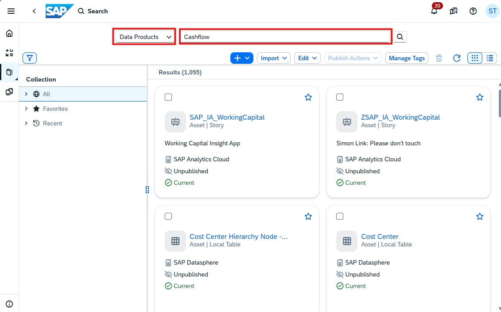
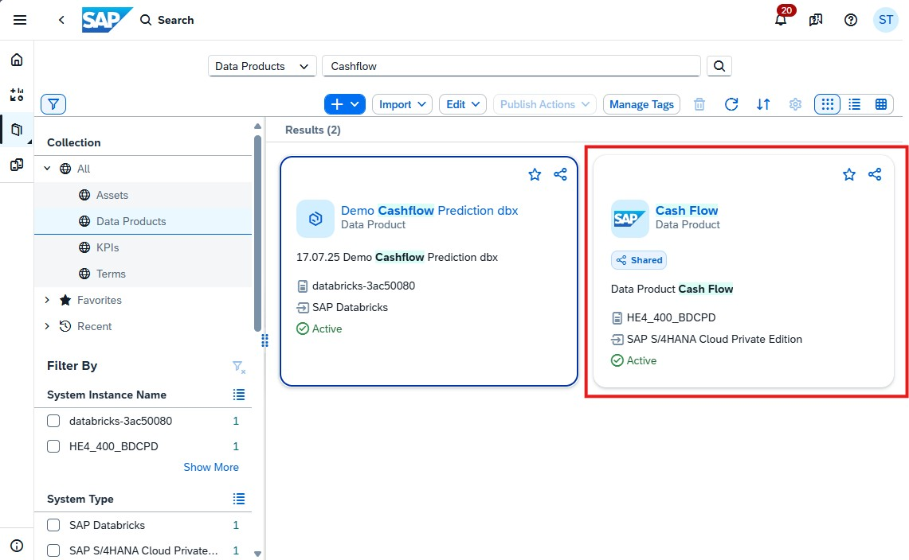
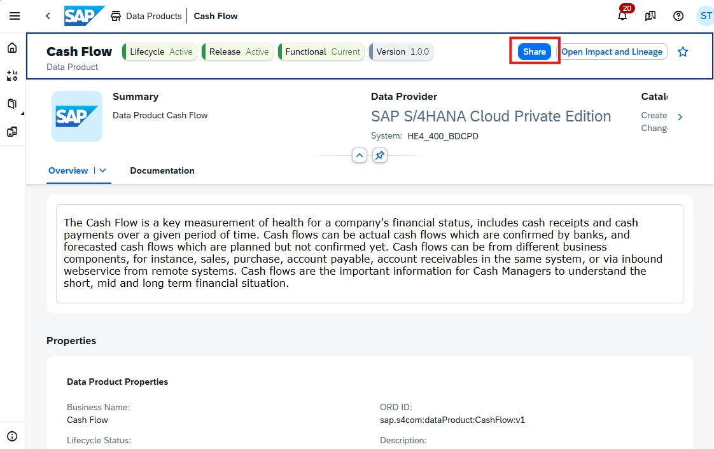
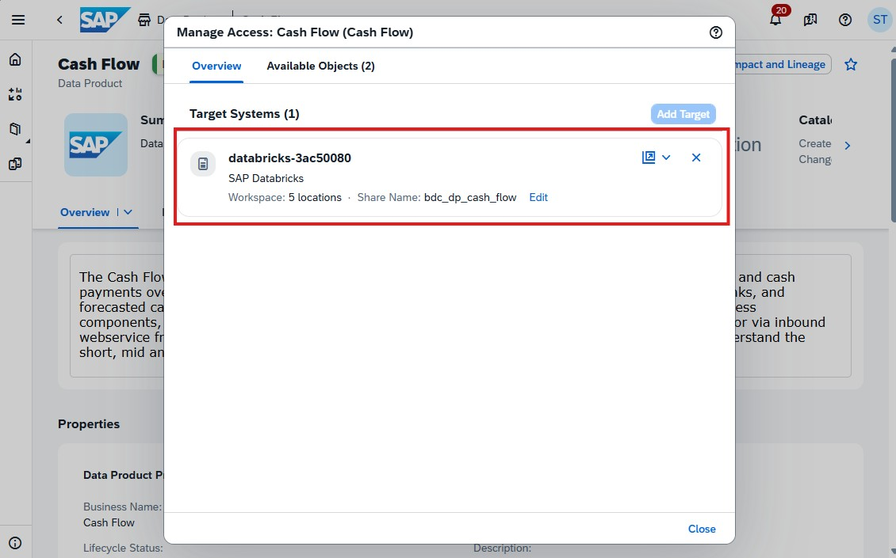
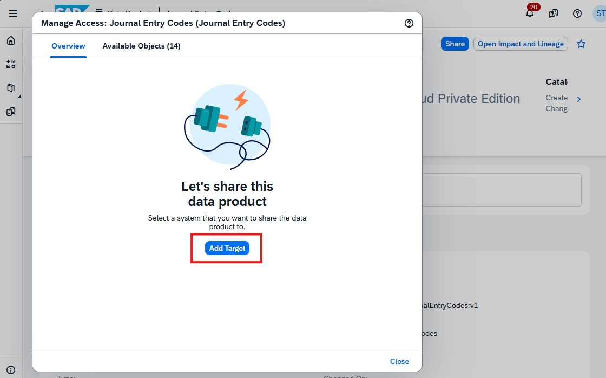
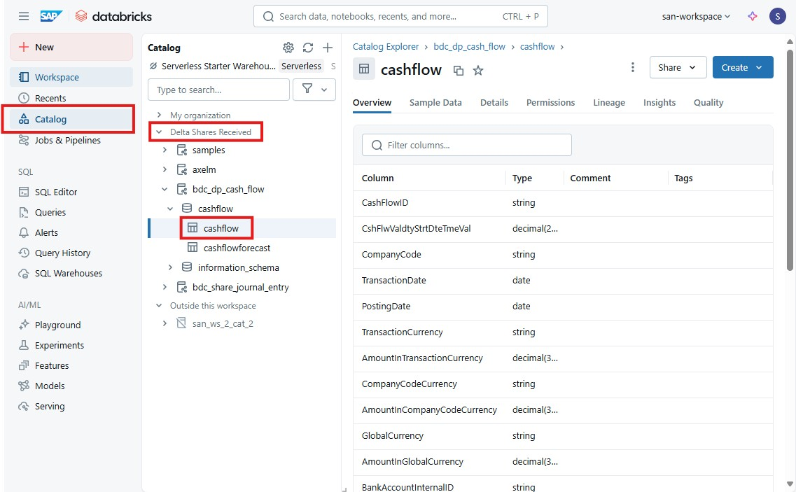
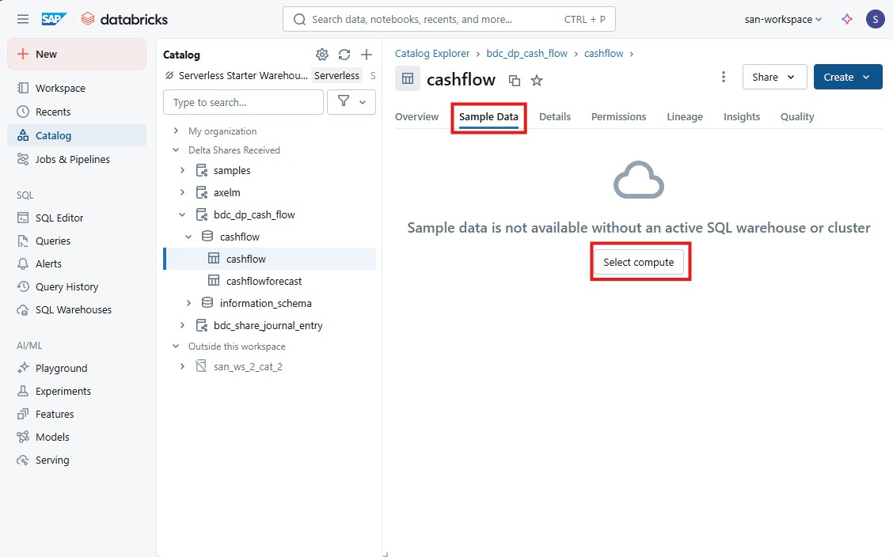
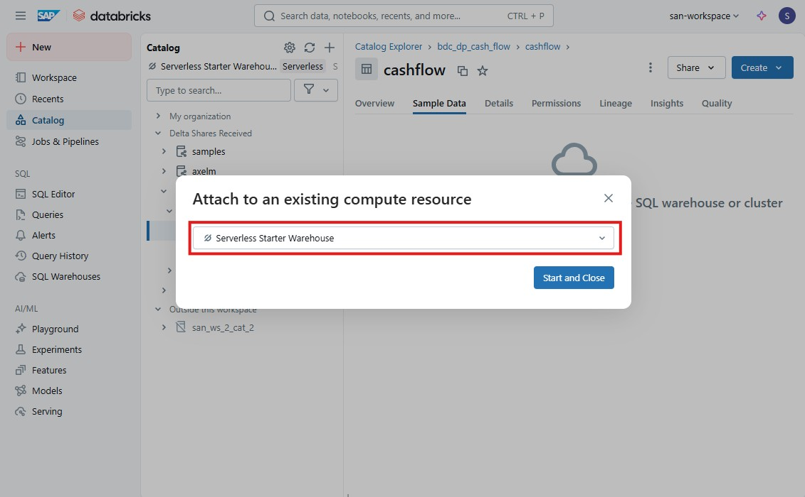
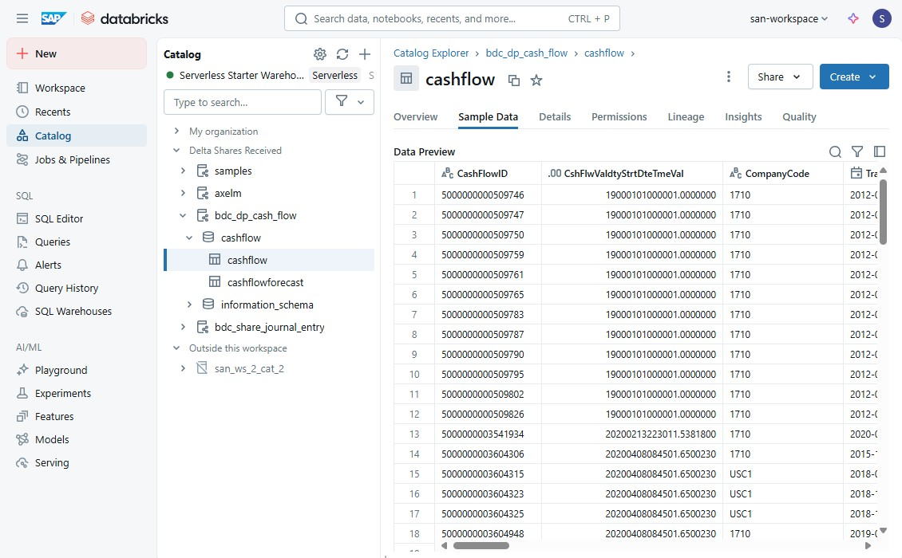

# Sharing Data Products to SAP Databricks

## Overview
This chapter describes the steps how Data Products in SAP Business Data Cloud (SAP BDC) are shared with SAP Databricks. We will use the **Delta Sharing**, which is an open protocol developed by Databricks and the Linux Foundation that enables secure, real-time data sharing across different platforms, clouds, and regions. It’s designed to break down data silos and make collaboration easier — WITHOUT requiring to copy data from one system to another.

## Prequisites

- Following Data Products are already installed and available in the SAP Business Data Cloud catalog:
    - **Cashflow**
    - tbd
- You need to have a BDC Admin role with "Delta Share" privilege.

## Excercise
1. Login to SAP Business Data Cloud Cockpit
2. Navigate to the Data Catalog
3. Search for the data product **Cashflow**
4. Open the data product page
5. Click on the *Share*-button to open the dialog
6. 

## Summary
