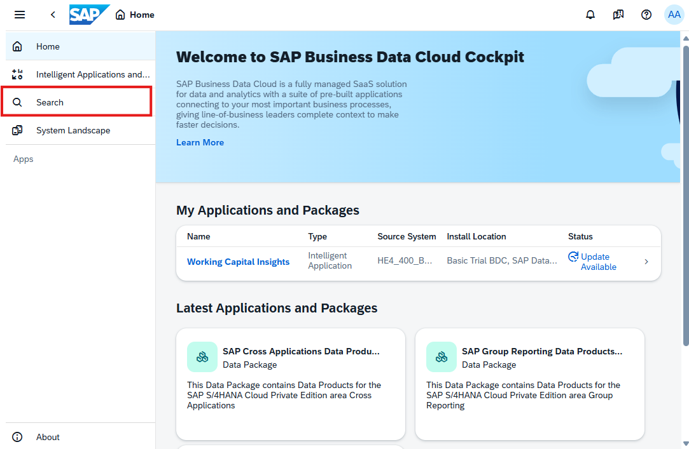
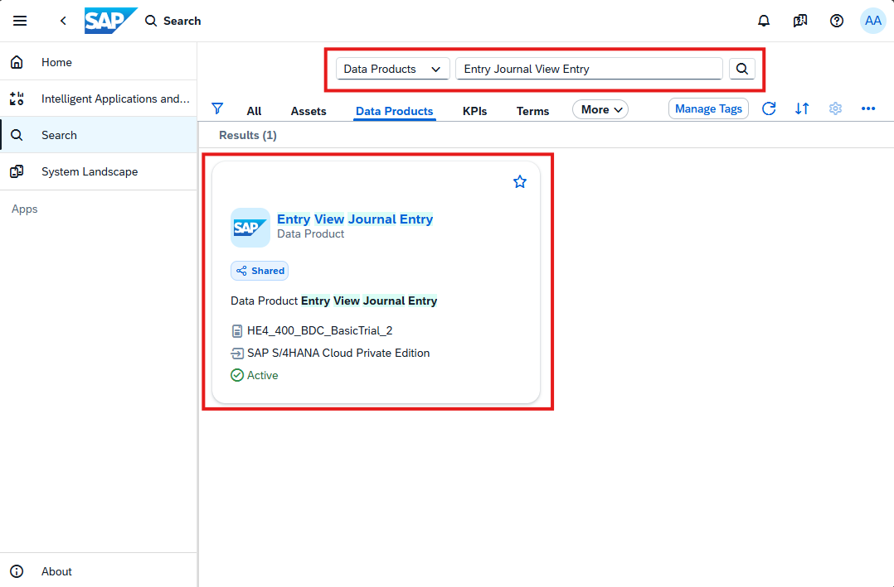
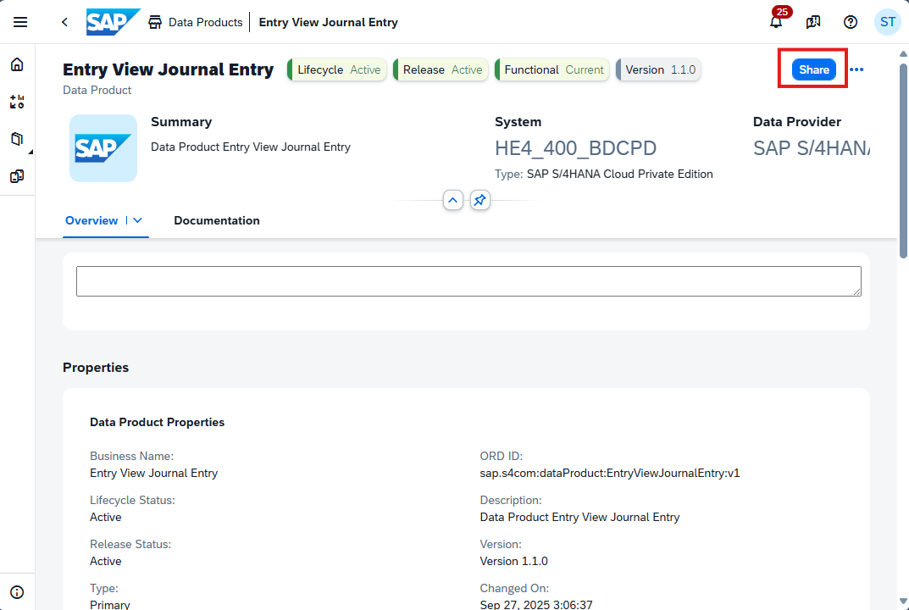
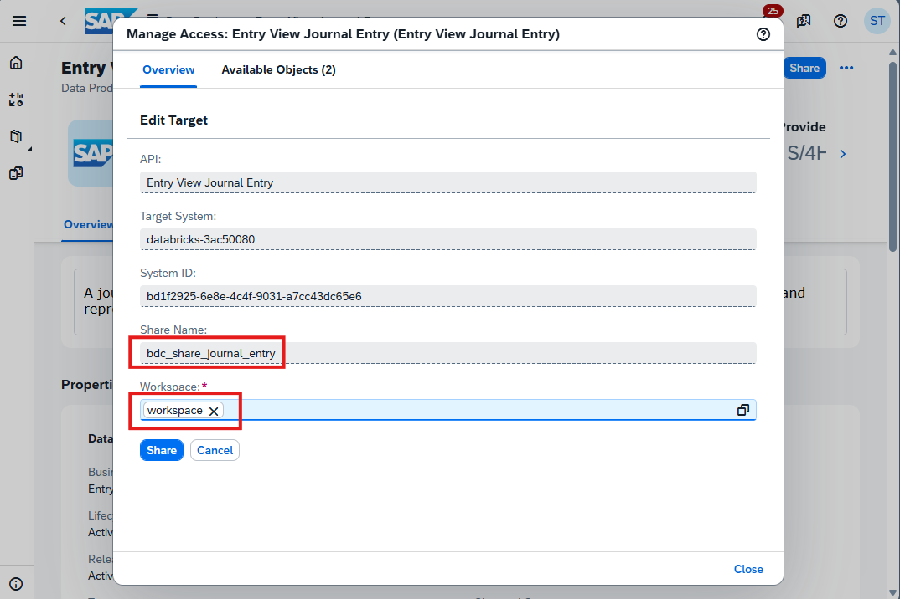
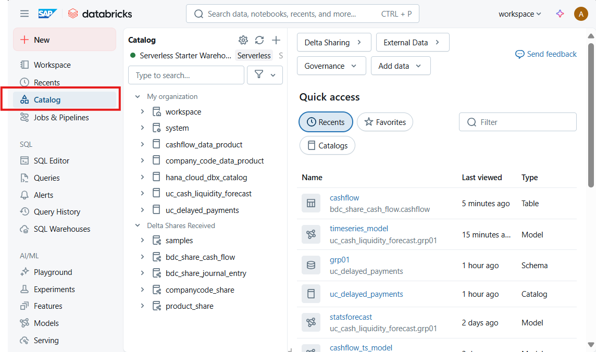
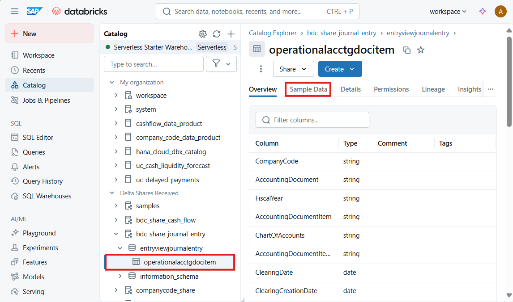
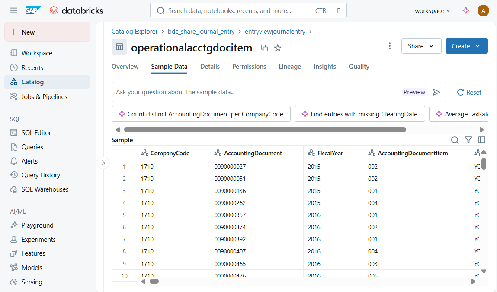

## Sharing `Entry View Journal Entry` Data Product to SAP Databricks
This chapter describes the steps how Data Products in SAP Business Data Cloud (SAP BDC) are shared with SAP Databricks. We will use the [**Delta Sharing**](https://www.databricks.com/product/delta-sharing), which is an open protocol developed by Databricks and the Linux Foundation that enables secure, real-time data sharing across different platforms, clouds, and regions. It’s designed to break down data silos and make collaboration easier — WITHOUT requiring to copy data from one system to another.

> [IMPORTANT]
> This is only a **read-only** exercise, since sharing data products in SAP Business Data Cloud requires ADMIN rights. The purpose is to illustrate the zero-copy data sharing principle, to get easy access to SAP managed and standardized data product economy.
 
#### Prequisites
- You have an BDC system landscape formation with **SAP S/4HANA Cloud Private Edition**
- Following Data Products are already installed and available in the SAP Business Data Cloud catalog:
    - **Entry View Journal Entry**
- You need to have a BDC Admin role with "Delta Share" privilege.

#### Exercise
1. Login to SAP Business Data Cloud Cockpit and click on `Search`to navigate to the Data Catalog.

    

2. Search for the data product **Entry View Journal Entry** and click on the tile to open.

     

3. On the detail page click on the *`Share`*-button to open the dialog

    

4. Enter a `Share Name` and target SAP Databricks `Workspace` and click on `<Share>`-button.

    

5. Login SAP Databricks and navigate to the Unity Catalog.

    

6. Navigate to the `Delta Shares Received`-->`entryviewjournalentry`, find the table `operationalacctgdocitem` and click on the tab `Sample Data`.

    

7. Click on `Select Compute`and select `Serverless Starter Warehouse`, then click on `Start and Close`.

    

8. Preview the `operationalacctgdocitem`sample data of the Data Product `Entry View Journal Entry`
 
    
