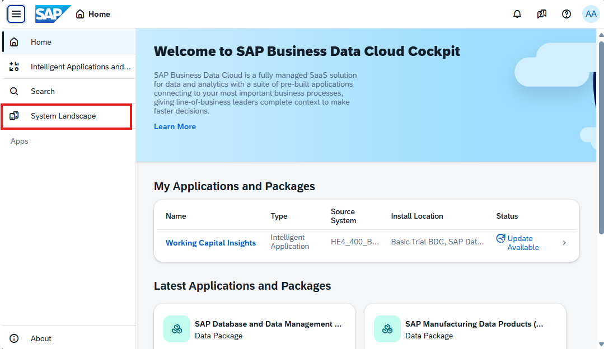
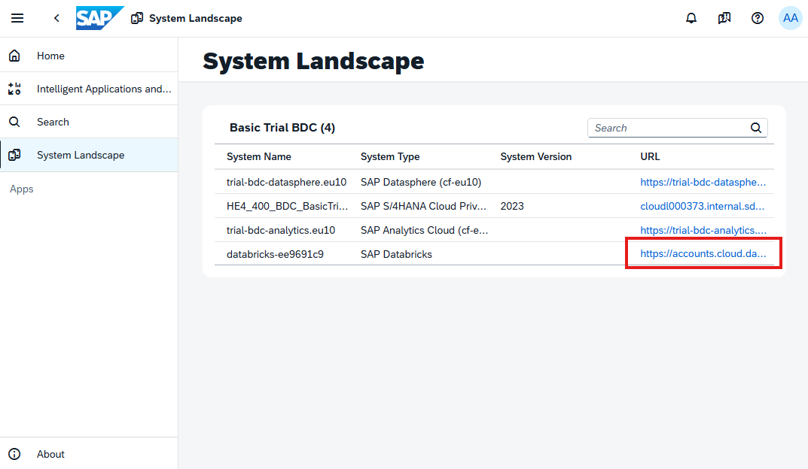
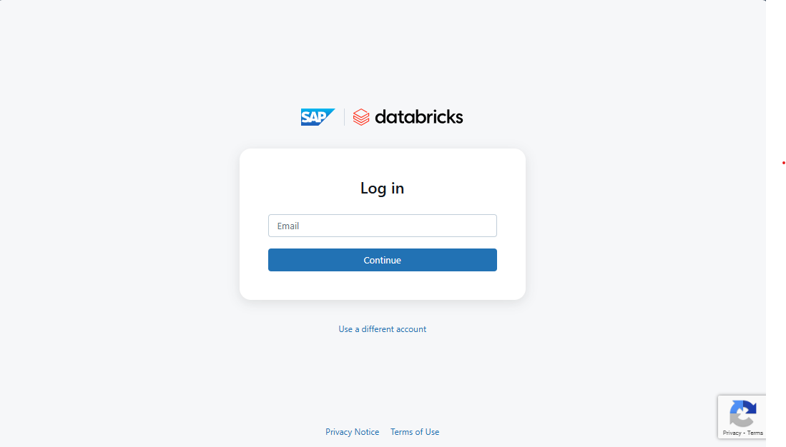
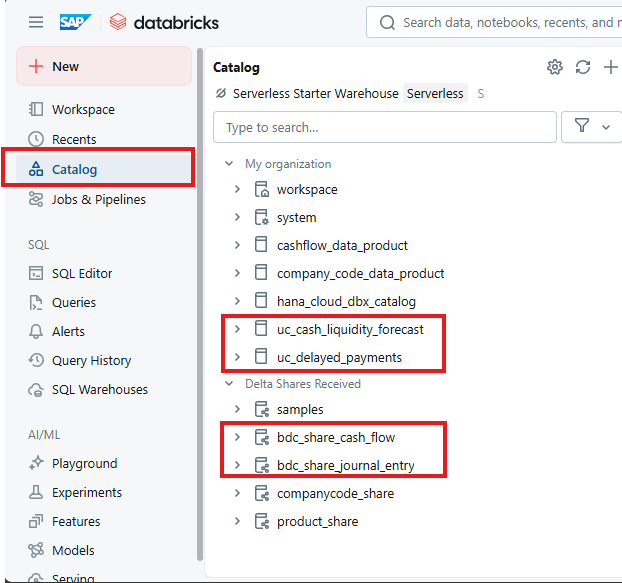
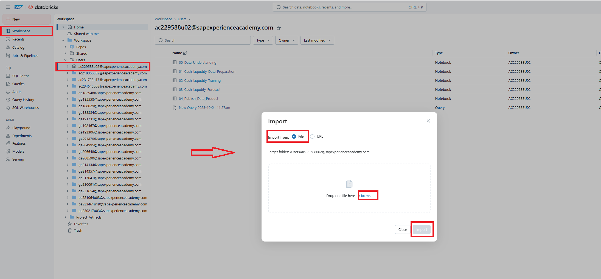
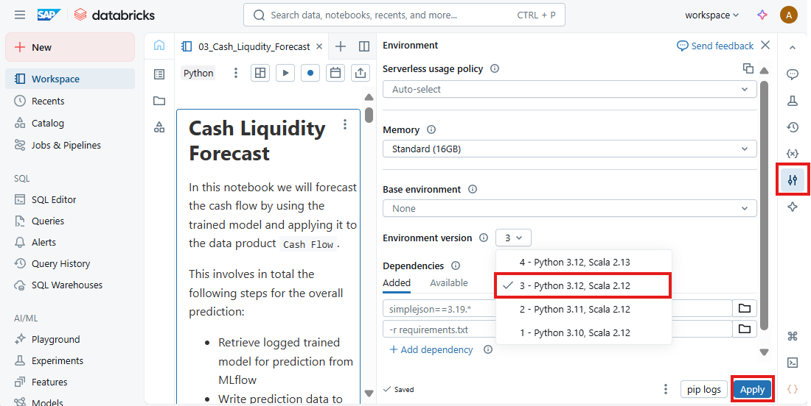
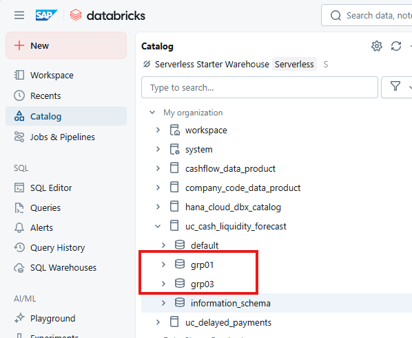

# DA266 - Operationalizing AI with SAP Databricks in SAP Business Data Cloud

## Description

This repository contains the material for the [SAP TechEd 2025](https://www.sap.com/events/teched.html) session called [DA266-Operationalizing AI with SAP Databricks in SAP Business Data Cloud](https://www.sap.com/events/teched/berlin/flow/sap/te25/catalog-inperson/page/catalog/session/1754081071909001LQxU). It covers end-to-end workflows and scripts for two main user case scenarios `Cashflow Prediction` and `Payment Delay Prediction`. The repository is organized to support both learning (Exercise) and reference (Solution) use cases, with each scenario broken down into modular notebooks that guide you through the data science lifecycle. 
>[!TIP]
>1. **Download this github repository**, you will need to upload the files into your SAP Databricks workspace
>2. **Requirements**: Please read the `Requirements` section below carefully since it contains key information for all exercises.
>3. **Start with the Exercise notebooks** to follow the guided workflow and implement each step yourself.
>4. **Refer to the Solution notebooks** for completed code and best practices.
>5. **Follow the notebook order** (as indicated by the numbering) for a logical progression from data understanding to publishing a data product.
>6. **Publishing to SAP Business Data Cloud (BDC)**: The final notebook in each scenario demonstrates how to expose your results as a data product using Delta Sharing and the SAP BDC Connect SDK.

## Loging SAP Databricks instance and first setups
1. Users and Password for SAP Databricks
    - should be provided by your workshop host
    - e.g. `ac229588u01@sapexperienceacademy.com`
2. Access to SAP Business Data Cloud Cockpit: https://trial-bdc-core.eu10.hcs.cloud.sap/bdc-ui/index.html#/
    - 
3. In the `System Landscape` page click on the SAP Databricks link to access the instance. The url link for that should be: https://accounts.cloud.databricks.com/select-workspace?account_id=779c1dfb-54a0-4c0b-ab10-657b3ea0e70b
    - 
4. Login with the provided user creditials. 
   - 
5. Before running the exercises, navigate to the *Unity Catalog* and check in the `My organization` for the following catalogs:
    - `uc_cash_liquidity_forecast`
    - `uc_delayed_payments`
      
   Furthermore, you will find in the `Received Deltas Shares` the shared data products from SAP Business Data Cloud:
    - `Cashflow` 
    - `Entry View Journal Entry`
    - 

6. Download this github repository into your local PC.
7. To import the notebook, navigate to your own folder (same as the user email assigned to you) under the `Workspace> Users` tab. In the whitespace, right-click or use the context menu and select `Import`. Then import the file in question from your system's File Explorer.
    - 
 
8. For the Python environment the exercises have been run with the python 3.12. Note: This has to be set manually for each notebook individually!
    - 

9. Please note, that in the exercises you will be asked to create in the catalog a `<SCHEMA>`, to have a clear separation of the exercise artefacts. The `<SCHEMA>` will follow the pattern `<catalog_name>.grp`+`<last_2_digits_of_user>`.
    - e.g. user ac229588u**01** will create correspondingly the schemas
        - `uc_cash_liquidity_forecast.grp01`
        - `uc_delayed_payments.grp01` 
      
      

## Requirements
Following pre-requisites should have been already prepared by the system administrator:
- Unity Catalog with 2 predefined catalogs with read and write access for all users:
    - `uc_cash_liquidity_forecast`
    - `uc_delayed_payments`
- The following SAP Data Products are shared and accessible by all users:
    - `Cashflow` 
    - `Entry View Journal Entry` 
- Appropriate permissions for all users to create schema within the above mentioned catalogs
- Access to a configured SAP AI Core Service intance with corresponding service key
    - https://help.sap.com/docs/sap-ai-core/sap-ai-core-service-guide/initial-setup
- Access to required Python packages
    - `sap-bdc-connect-sdk` 
    - `sap-ai-sdk-gen` 
- Configured SECRET SCOPE
    - This step has already been done by the administrator to facilitate the sharing process. However, if you need to do it on you own you can follow the steps described here to create a secret scope: To create a secret scope you can either use the following URL `https://<databricks-instance>#secrets/createScope`. Replace `<databricks-instance>` with the workspace URL of your Databricks deployment.
    - Alternatively, you can run the following command in the terminal by clicking on the terminal icon on the lower right corner: `databricks secrets create-scope sap-bdc-connect-sdk`. 
    - The secret scope only has to be created once and can be made accessible to all workspace users by either toggling `manage principal` to `all workspace users` or via the terminal using the following command `databricks secrets put-acl sap-bdc-connect-sdk users READ`. To check whether the assignment worked, you can then use the command `databricks secrets list-acls sap-bdc-connect-sdk`.
    - A full explanation can be found here https://docs.databricks.com/aws/en/security/secrets/example-secret-workflow     

## Exercises
- ### Use Case 1: Cashflow Forecast
    - **Scenario**:
        The data scientist wants to forecast the cashflow for the upcoming 6 months and make the result available for reporting. For that he needs to access the cashflow data product from S/4HANA, apply ML/AI model training and forecasting, and share / install the enriched data product in BDC Cockpit and Datasphere. 

    - **Key Learnings**:
        - Sharing Data Product to SAP Databricks
        - Enrich Data Product with ML/AI Insights, e.g. 
            -  Data understanding and preparation
            -  Train time series forecast model 
            -  Apply cashflow forecast
        - MLFlow for monitoring query performance 
        - Re-sharing custom Data Product to BDC Data Catalog with `sap-bdc-connect-sdk`
    - **Exercises**:
        - [00_Share_Cashflow_Data_Product.md](./Cashflow_prediction/Exercise/00_Share_Cashflow_Data_Product.md)
        - [01_Data Understanding.ipynb](./Cashflow_prediction/Exercise/01_Data_Understanding.ipynb)
        - [02_Cash_Liquidity_Data_Preparation.ipynb](./Cashflow_prediction/Exercise/02_Cash_Liquidity_Data_Preparation.ipynb)
        - [03_Cash_Liquidity_Training.ipynb](./Cashflow_prediction/Exercise/03_Cash_Liquidity_Training.ipynb)
        - [04_Cash_Liqudity_Forecast.ipynb](./Cashflow_prediction/Exercise/04_Cash_Liqudity_Forecast.ipynb)
        - [05_Publish_Data_Product.ipynb](./Cashflow_prediction/Exercise/05_Publish_Data_Product.ipynb)
    - **Solution**
        - [00_Share_Cashflow_Data_Product.md](./Cashflow_prediction/Solution/00_Share_Cashflow_Data_Product.md)
        - [01_Data Understanding.ipynb](./Cashflow_prediction/Solution/01_Data_Understanding.ipynb)
        - [02_Cash_Liquidity_Data_Preparation.ipynb](./Cashflow_prediction/Solution/02_Cash_Liquidity_Data_Preparation.ipynb)
        - [03_Cash_Liquidity_Training.ipynb](./Cashflow_prediction/Solution/03_Cash_Liquidity_Training.ipynb)
        - [04_Cash_Liqudity_Forecast.ipynb](./Cashflow_prediction/Solution/04_Cash_Liqudity_Forecast.ipynb)
        - [05_Publish_Data_Product.ipynb](./Cashflow_prediction/Solution/05_Publish_Data_Product.ipynb)

- ### Use Case 2: Payment Delay Prediction
    - **Scenario**:
        The data scientist needs to predict payment delays and run a root cause analysis. He has to provide the key drivers for the delays and an explanation in a human readable manner. For that he combines SAP Databricks and AI Foundation LLM capabilities to derive the insights. These insights will help the Financial Controller to better understand the payment delays problem and to derive the corresponding actions to mitigate.

    - **Key Learnings**:
        - Advanced ML/AI capabilities
            - Determine key drivers for payment delay via SHAP Values
            - Visualizing SHAP Values
            - Hyperparameter optimization with xgboost
        - Integrating SAP AI Core Service for LLM modelling
            - Configure SAP AI Core `orchestration services`
        - Implementing MLFlow custom model with PyFunc for monitoring and logging
    - **Exercises**:
        - [00_Share_Entry_Journal_Entry_View_Data_Product.md](./Payment_delay_prediction/Exercise/00_Share_Entry_Journal_Entry_View_Data_Product.md)
        - [01_Payment_Delay_Data_Preparation.ipynb](./Payment_delay_prediction/Exercise/01_Payment_Delay_Data_Preparation.ipynb)
        - [02_Payment_Delay_Training.ipynb](./Payment_delay_prediction/Exercise/02_Payment_Delay_Training.ipynb)
        - [03_Payment_Delay_Inference.ipynb](./Payment_delay_prediction/Exercise/03_Payment_Delay_Inference.ipynb)
        - [04_Payment_Delay_Explain.ipynb](./Payment_delay_prediction/Exercise/04_Payment_Delay_Explain.ipynb)
        - [05_Publish_Data_Product.ipynb](./Payment_delay_prediction/Exercise/05_Publish_Data_Product.ipynb)
    - **Solution**
        - [00_Share_Entry_Journal_Entry_View_Data_Product.md](./Payment_delay_prediction/Solution/00_Share_Entry_Journal_Entry_View_Data_Product.md)
        - [01_Payment_Delay_Data_Preparation.ipynb](./Payment_delay_prediction/Solution/01_Payment_Delay_Data_Preparation.ipynb)
        - [02_Payment_Delay_Training.ipynb](./Payment_delay_prediction/Solution/02_Payment_Delay_Training.ipynb)
        - [03_Payment_Delay_Inference.ipynb](./Payment_delay_prediction/Solution/03_Payment_Delay_Inference.ipynb)
        - [04_Payment_Delay_Explain.ipynb](./Payment_delay_prediction/Solution/04_Payment_Delay_Explain.ipynb)
        - [05_Publish_Data_Product.ipynb](./Payment_delay_prediction/Solution/05_Publish_Data_Product.ipynb)

## Contributing
Please read the [CONTRIBUTING.md](./CONTRIBUTING.md) to understand the contribution guidelines.

## Code of Conduct
Please read the [SAP Open Source Code of Conduct](https://github.com/SAP-samples/.github/blob/main/CODE_OF_CONDUCT.md).

## How to obtain support

Support for the content in this repository is available during the actual time of the online session for which this content has been designed. Otherwise, you may request support via the [Issues](../../issues) tab.

## License
Copyright (c) 2024 SAP SE or an SAP affiliate company. All rights reserved. This project is licensed under the Apache Software License, version 2.0 except as noted otherwise in the [LICENSE](LICENSES/Apache-2.0.txt) file.
